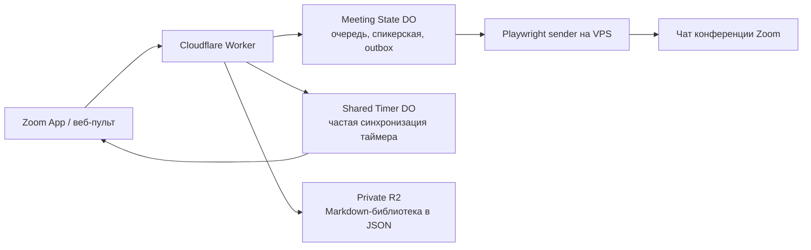

# Nafanya Zoom Bridge

Открытый комплект для управления собранием из приложения Zoom:

- кнопки готовых сообщений;
- свободная очередь участников и дополнительные темы;
- отдельный список вопросов для спикерской;
- общий таймер ведущего с нативным индикатором и сигналом Zoom;
- отправка отрывков из личной Markdown/Obsidian-базы;
- браузерный участник-бот, который публикует подготовленные сообщения в чат Zoom.

Таймер работает независимо от участника-бота: для него нужны Worker, control-agent и открытое приложение хотя бы у одного настольного Zoom-клиента. Sender нужен только для публикации сообщений в чат.

Это самостоятельная Zoom-only версия. В ней нет Telegram, старого движка очередей, адресов или логотипов исходной группы, паролей, cookies и текстов книг.

## Как это устроено



Частый таймер намеренно отделён от состояния собрания. Поэтому его синхронизация не перечитывает и не перезаписывает очередь, объявления и outbox — маленький секундомер больше не бегает по серверу с комодом на спине.

Вход нового участника не публикует темы повторно. Для окончания собрания под разделом спикерской есть одна общая красная кнопка: она атомарно очищает обычную очередь, дополнительные темы и вопросы спикеру.

## Быстрый старт

1. Сделайте fork или скачайте репозиторий.
2. Измените [`config/group.json`](config/group.json): расписание, кнопки, тексты и название.
3. Разверните Worker и создайте R2 по инструкции [`docs/INSTALL.md`](docs/INSTALL.md).
4. Создайте собственное General App в Zoom Marketplace и укажите свой домен.
5. Запустите sender и защищённый control-agent на VPS.
6. Один раз авторизуйте браузерный профиль бота в Zoom.
7. Загрузите свою Markdown-библиотеку через админский пульт.

Эксперимент с редактированием прежнего сообщения через официальный Team Chat API описан отдельно в [`docs/TEAM_CHAT_TEST.md`](docs/TEAM_CHAT_TEST.md). Он выключен по умолчанию и изолирован от рабочей конференции.

Полная последовательность без шаманства и пропущенных галочек: [`docs/INSTALL.md`](docs/INSTALL.md).

## Что меняет другая группа

- `config/group.json` — дни, кнопки, тексты, литература и часовой пояс;
- `sender/.env` — адрес Worker, постоянная ссылка Zoom, имя бота и секреты;
- Zoom Marketplace — название приложения, иконка, Home URL и разрешённый домен;
- Caddy — собственный домен;
- зал ожидания и оформление — в настройках своего Zoom-аккаунта;
- Markdown-база — только собственные тексты, которыми группа вправе пользоваться.

## Проверка

```bash
npm --prefix worker ci
npm --prefix sender ci
npm test
npm --prefix worker run check
```

Тесты проверяют очередь, общую очистку, повторные нажатия, одинаковые записи, спикерскую, лимит 950 Unicode-символов, библиотечный импорт, нативный общий таймер, outbox/ack, выключенные микрофон и видео, защиту секретов и Docker-упаковку.

Шаблон сцены Immersive View лежит в [`assets/immersive-view.example.svg`](assets/immersive-view.example.svg). Замените название группы и экспортируйте в PNG 1920×1080. Сцену включает организатор с настольного Zoom; это не постоянные обои аккаунта.

## Важные ограничения

- Это не официальный продукт Zoom и не связан с Alcoholics Anonymous World Services.
- Книжные тексты не распространяются вместе с кодом. Проверьте права на материалы до загрузки.
- Браузерная автоматизация зависит от интерфейса Zoom Web Client. После крупных обновлений Zoom сначала запускайте тестовую конференцию.
- Нативный сигнал таймера создаёт Zoom через `setDynamicIndicator({ withSound: true })`; мелодию и длительность определяет Zoom. Для общего индикатора нужен хотя бы один открытый настольный экземпляр приложения.
- Публичный GitHub содержит код, но каждый владелец разворачивает собственные Cloudflare, VPS и Zoom App. Общие секреты между группами использовать нельзя.

Лицензия: [MIT](LICENSE).
